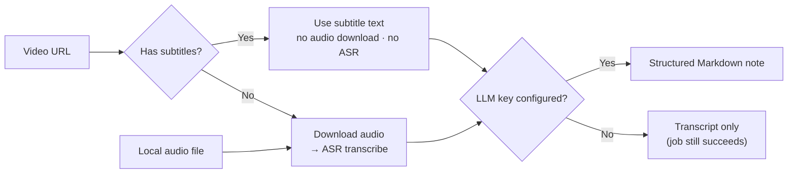

# VTS — Video to Summary

> Turn any video URL (YouTube, Bilibili, or any site yt-dlp supports) or a local audio
> file into structured Markdown notes.

**Subtitle-first · Self-hosted · BYOK · Markdown-first**


[](https://github.com/soloworktop/vts/actions/workflows/oss-guard.yml)
[](https://github.com/soloworktop/vts/releases)

> 中文文档：[`README.md`](README.md)。


<p align="center"><sub>Web console: job status, live progress, in-place artifact editing, full-text search (screenshot shows sample data)</sub></p>

---

## Why VTS

VTS is for people who want to turn long-form video into reusable personal knowledge
without handing it to a third-party SaaS:

- **Subtitle-first** — when a video has subtitles (human or platform-generated), the
  subtitle text is used directly as the transcript: no audio download, no transcription
  API call;
- **Local-first** — VTS does not host your data: jobs, the database, and artifacts are
  managed by your own machine. When you use cloud ASR / LLM, the corresponding audio or
  text is sent to the services you configure (see [Security](#security));
- **BYOK (Bring Your Own Key)** — not tied to any model vendor. LLM summaries work with
  any **OpenAI-compatible** API — OpenAI, DeepSeek, Moonshot, a self-hosted vLLM /
  Ollama gateway…; transcription (ASR) for subtitle-less videos works with any
  compatible endpoint implementing `/audio/transcriptions`. Either way, just set
  `base_url` / `api_key` / `model`;
- **Markdown-first** — artifacts are plain files (Markdown / TXT / SRT): editable,
  searchable, versionable, and portable;
- **Open & portable** — MIT licensed, web console and CLI in one project; your data and
  artifacts are standard files not tied to any specific service, ready to export or
  migrate anytime.

## Features

| Capability | What it means |
|---|---|
| Subtitle-first | Videos with subtitles produce notes straight from the subtitle text — no audio download, no ASR |
| Transcription | Only for videos without subtitles: point at any OpenAI-compatible Whisper endpoint you configure, no local models to install |
| AI summaries | 10 built-in templates to switch style instantly (see [CLI](#cli)); custom templates via the web console |
| Job management | Live progress, cancel, retry (with a different template), automatic resume after restart |
| Notes management | In-place artifact editing, labels, full-text search with highlighted hits |
| Export & migration | Per-job Markdown export; the whole history packs into one zip; artifacts are `.summary.md` / `.txt` / `.srt` / `.segments.json` |
| Self-hosted | Your data stays on your machine; one command to start with Docker |
| Security | API keys encrypted at rest, path-traversal guard on artifacts, optional Bearer-token auth, one-click sanitized diagnostic log export |

## How it works



- **Subtitle-first**: when a URL video has subtitles, the subtitle text is used directly
  as the transcript — no audio download, no ASR call — faster, and no transcription
  drift;
- **No LLM key yet? The job still succeeds**: summarization is skipped and you still get
  the raw transcript (`.txt` / `.srt`); add a key later and hit "Regenerate" for the full
  note.

---

## Quick start

### Docker (recommended)

```bash
docker run -d --name vts -p 8080:8080 \
  -v vts_data:/data -v vts_output:/output \
  --restart unless-stopped \
  ghcr.io/soloworktop/vts:latest

# Or, with the repository cloned, build from source in one command:
docker compose -f docker/docker-compose.yml up -d --build
```

Open <http://127.0.0.1:8080> for the console (health check at `/api/v1/health`). Data
lives in the `vts_data` / `vts_output` volumes and survives container removal and
`down`; image tags, port conflicts, upgrades, and the Bilibili 412 playbook:
[`docker/README.md`](docker/README.md) (Chinese).

**Your first job (5 minutes)**:

1. Settings → LLM Configuration: enter your OpenAI-compatible endpoint and key (that is
   the only setup a subtitled video needs);
2. New job: paste a video URL and pick a summary template (the default `通用` is fine);
3. Start, and watch the live progress;
4. Get the Markdown note — edit it in place, label it, search it.

### Local run (venv)

Requires **Python 3.10+**; ffmpeg is only needed when a subtitle-less video must be
transcribed (see [FAQ](#faq)):

- macOS: `brew install ffmpeg` · Debian / Ubuntu: `sudo apt install ffmpeg` ·
  Windows: `winget install Gyan.FFmpeg`

```bash
python3 -m venv .venv
source .venv/bin/activate                 # Windows PowerShell: .venv\Scripts\Activate.ps1
pip install -e .
bash scripts/web.sh                      # open http://127.0.0.1:8080
```

> Just want the CLI, no local development? Install the distribution wheel from
> [Releases](https://github.com/soloworktop/vts/releases) (not on PyPI yet):
> `pip install https://github.com/soloworktop/vts/releases/download/v0.1.0/vts-0.1.0-py3-none-any.whl`.
> Native Windows has no bash: run `python -m video_to_summary.main` directly, or use WSL.

---

## What you get

Every artifact is a plain file: editable, searchable, versionable, portable. Under the
web / Docker form each job gets its own subdirectory (`VIDEO_TO_SUMMARY_OUTPUT_DIR`
changes the base directory):

```text
output/
└── <job-id>/
    ├── <content-id>.summary.md     # structured Markdown note (always, editable in place)
    ├── <content-id>.txt            # raw transcript (always)
    ├── <content-id>.srt            # SRT subtitles (when timing data is available)
    ├── <content-id>.segments.json  # segment data (when timing data is available)
    └── <content-id>.polished.txt   # polished transcript (when polishing is enabled)
```

`<content-id>` is the platform video ID for URL sources, or the original file name for
local files. The CLI has no per-job subdirectory: files land directly in `output/`
(`--output-dir` to change).

The fixed structure of `.summary.md` is shown below. **Note: this is a structure
example** — the title, source, and body are placeholders, not a real run; the body
follows the typical layout of the default `通用` (General) template (core conclusion
first, then topic sections, keeping key numbers and actionable advice):

```markdown
# Video title

- **Source**: <video-url>
- **Duration**: 38 minutes

## Summary

<LLM-generated body: a one-sentence core conclusion first, then topic sections>

## Key points

### 1. <point one>

<supporting evidence and key numbers>

### 2. <point two>

<supporting evidence and key numbers>

## Actionable advice

- <advice one>
- <advice two>
```

---

## Configuration

Configure progressively — only what your situation needs:

| Video | Configuration | Result |
|---|---|---|
| Has subtitles | LLM key | Full note (transcript + summary) |
| Has subtitles | none | Raw transcript only (`.txt` / `.srt`); the job still succeeds |
| No subtitles | ASR transcription config + LLM key | Full note |
| No subtitles | no ASR config | Job ends with an actionable configuration error |

### Minimal configuration: an LLM key (all a subtitled video needs)

Put the config in a `.env` (copy from [`.env.example`](.env.example)). VTS searches for
`.env` **upward from the directory you run the command in** — put it next to where you
invoke `vts` (or in a parent such as your home directory). The inference slot is the
`SUMMARY_*` triplet (legacy `LLM_*` / `OPENAI_API_KEY` names are still recognized):

```ini
SUMMARY_API_KEY=sk-xxx
SUMMARY_BASE_URL=https://api.deepseek.com/v1
SUMMARY_MODEL=deepseek-chat
```

The web console offers the same settings visually (Settings → LLM Configuration), or use
the HTTP API — keys are encrypted at rest and the API only returns masked values:

```bash
curl -X PUT localhost:8080/api/v1/llm -H 'Content-Type: application/json' \
  -d '{"summary":{"base_url":"https://api.deepseek.com/v1","api_key":"sk-xxx","model":"deepseek-chat"},
       "asr":{"base_url":"https://api.openai.com/v1","api_key":"sk-xxx","model":"whisper-1"}}'
```

> **No key yet? The job still succeeds:** you get the raw transcript; add a key and hit
> "Regenerate" for the full note.

### Videos without subtitles: add ASR

Any OpenAI-compatible endpoint implementing `/audio/transcriptions` works for
transcription. The transcription slot uses the same triplet shape:

```ini
ASR_API_KEY=sk-xxx                     # this line alone suffices for OpenAI's official API
ASR_BASE_URL=https://your-gateway/v1   # for third-party / self-hosted endpoints
ASR_MODEL=whisper-1                    # model name required by that endpoint (default: whisper-1)
```

CLI equivalent: `vts "<video-url>" --asr-key sk-xxx [--asr-base-url … --asr-model …]`.

### Content behind login

Bilibili AI/CC subtitles, YouTube auto-generated subtitles, and member-only content
usually require a logged-in session. No site login integration is built in — two ways to
provide it (mutually exclusive; an explicit cookies file wins):

1. **cookies file**: `--cookies cookies.txt` (CLI) or the `VTS_COOKIES_FILE` environment
   variable. `cookies.txt` is Netscape format — export it from a logged-in browser with
   an extension such as "Get cookies.txt LOCALLY";
2. **browser cookies**: web console → Settings → Network & Access → "browser cookies" —
   reads your local browser's login state. The first Chrome-family read triggers a macOS
   Keychain prompt; unavailable inside Docker — use option 1 there.

### Full configuration reference

Complete environment-variable semantics (incl. legacy aliases), data-location rules, and
version injection: [`docs/configuration.md`](docs/configuration.md) (Chinese); the
Docker context (volumes, ports, mirrors): [`docker/README.md`](docker/README.md)
(Chinese).

---

## CLI

`vts` is installed along with the package, equivalent to
`python -m video_to_summary.main`:

```bash
vts "<video-url>"
# The simplest form. With subtitles, no transcription setup is needed; without an
# LLM key, only the raw transcript is produced.

vts "<video-url>" --summary-template 学术笔记
# Pick a summary template.

vts "<video-url>" --summary-key sk-xxx --summary-base-url https://api.deepseek.com/v1 --summary-model deepseek-chat
# Bring your own LLM for one run; for daily use put it in .env (see Configuration).

bash scripts/run.sh "<video-url>"
# No manual venv: creates the environment, installs deps, then runs — same arguments.
```

10 built-in summary templates (the CLI accepts the built-in names; the web console also
supports custom ones): `通用` (General, default) / `精简笔记` (Concise) /
`详细笔记` (Detailed) / `教程笔记` (Tutorial) / `学术笔记` (Academic) /
`会议纪要` (Meeting minutes) / `商业分析` (Business analysis) /
`小红书笔记` (Xiaohongshu-style) / `生活随笔` (Life notes) / `任务清单` (Task list).

Success looks like the last line `summary -> output/<content-id>.summary.md`. Every
option: [`docs/cli.md`](docs/cli.md) (Chinese) and `vts --help`; scripted examples:
[`examples/`](examples/).

---

## Data & backups

The SQLite database `app.db` (job history, labels, templates, encrypted keys) defaults
to:

- **Source checkout / editable install** (`pip install -e .`): `<checkout-root>/data/app.db`
- **Installed as a package** (non-editable): the platform user data dir — macOS
  `~/Library/Application Support/VTS/`, Windows `%LOCALAPPDATA%\VTS\`, Linux etc.
  `$XDG_DATA_HOME/vts/`

Any form can be overridden with `VIDEO_TO_SUMMARY_DB` (Docker already defaults to
`/data/app.db`).

**Backup / migration**: stop the service, then copy `app.db` (together with the sibling
`enc_key` file) and the whole `output/` directory to the same location in the new
environment; in Docker they correspond to the `vts_data` / `vts_output` volumes — export
tips in `docker/README.md` (Data persistence). The full path-resolution rules:
[`docs/configuration.md`](docs/configuration.md).

---

## Documentation

| I want to… | See |
|---|---|
| Get started | [Quick start](#quick-start) above |
| Daily usage (illustrated manual) | built-in guide: <http://127.0.0.1:8080/guide> |
| Deploy with Docker / upgrade / fix Bilibili 412 | [`docker/README.md`](docker/README.md) (Chinese) |
| Configure LLM / ASR / every environment variable | [`docs/configuration.md`](docs/configuration.md) (Chinese) / [`.env.example`](.env.example) |
| Call the HTTP API | [`docs/api.md`](docs/api.md) (canonical prefix `/api/v1`, `VIDEO_TO_SUMMARY_TOKEN` auth) |
| Look up a CLI option | [`docs/cli.md`](docs/cli.md) (Chinese) / `vts --help` |
| Build plugins & capability extensions | [`docs/plugins.md`](docs/plugins.md) (capabilities exposed via `GET /api/v1/capabilities`) |
| Harden a deployment / report a vulnerability | [`SECURITY.md`](SECURITY.md) |
| Contribute | [`CONTRIBUTING.md`](CONTRIBUTING.md) (Chinese) |
| Understand repo conventions (contributors / agents) | [`AGENTS.md`](AGENTS.md) (Chinese) |

---

## Security

VTS is designed for **personal self-hosting** and listens on localhost only by default.
If you expose the service beyond your machine, you **must** set
`VIDEO_TO_SUMMARY_TOKEN` to enable Bearer auth first (see
[`docs/api.md`](docs/api.md)).

- VTS itself provides no cloud storage: jobs, the database, and artifacts live on your
  machine. However, when you use third-party ASR / LLM APIs, the corresponding audio or
  text is sent to the providers you configure — subject to your configuration and their
  data policies;
- API keys are Fernet-encrypted at rest; the API only ever returns masked values;
- Treat cookies like account credentials: keep them safe, never commit them to the
  repository or paste them into files you share;
- Vulnerability reporting and self-hosting hardening notes:
  [`SECURITY.md`](SECURITY.md).

---

## What VTS deliberately does not include

VTS is intentionally single-user and BYOK-only; the following are out of scope for the
core:

- **No local transcription engine** — transcription goes through an OpenAI-compatible
  Whisper API you configure; no local model downloads;
- **No built-in site login integration** — provide login state yourself via cookies (see
  Configuration);
- **No PDF export** — artifacts are Markdown; full-history export/import is zip;
- **Single-user** — no accounts, no multi-tenancy, no usage dashboards;
- **No watermarks** — artifacts are plain files as-is, with nothing injected.

Some of these (e.g. PDF export) can be added via the plugin mount point. The full scope
rationale lives in `CONTRIBUTING.md` (Scope declaration, Chinese).

---

## Development

```bash
pip install -e ".[dev]"
python -m pytest -q                    # offline by default; network cases need VTS_NETWORK_TESTS=1
pip install -e ".[e2e]" && playwright install chromium
bash scripts/e2e.sh                    # end-to-end (real uvicorn + in-process fakes)
bash scripts/e2e.sh live               # live-boundary end-to-end (real download/transcribe/LLM; needs keys in .env, skipped by default)
```

Before running the test suite locally for the first time, build the frontend:
`cd web-src && pnpm install && pnpm build` (CI builds it automatically; without a built
frontend the static-file test fails with a 404 — an environment prerequisite, not a
regression).

Repo conventions: `AGENTS.md`. Contribution scope and process: `CONTRIBUTING.md`.

---

## FAQ

### Bilibili videos fail with HTTP 412 / no subtitles?

**HTTP 412** usually relates to Bilibili's request risk control on video pages: yt-dlp's
default (browser-like) UA is more likely to be blocked, and a custom non-browser UA
recovers in common scenarios — though not guaranteed for every network environment.
**Missing subtitles** usually means the CC/AI subtitles need a logged-in session, and the
Web/Docker form has no local browser. Try the following in order:

1. Custom User-Agent: set env `VTS_USER_AGENT=Wget/1.21.3` (applies to CLI / Web / Docker; unset keeps default behavior);
2. Login cookies: set env `VTS_COOKIES_FILE` to a cookies.txt path (equivalent to CLI `--cookies`; also unlocks Bilibili CC/AI subtitles);
3. Proxy: configure one in Settings → Network & Access (Web), or pass `--proxy` (CLI).

How well these work varies with your network environment and the site's risk-control
policy. Full background and compose examples: `docker/README.md` → "网络与风控（B 站 412
等）" (Network & risk control).

### Asked to install ffmpeg / ffprobe — is it required?

Only the "no subtitles → download audio → transcribe" path uses it; videos with subtitles
never touch it. If a transcription error mentions ffmpeg / ffprobe, install it per
[Quick start](#quick-start) and run again (macOS `brew install ffmpeg`,
Debian/Ubuntu `sudo apt install ffmpeg`, Windows `winget install Gyan.FFmpeg`).

### Port 8080 is taken

`bash scripts/web.sh` automatically advances to the next free port — trust the actual URL
printed in the startup log. To pin a port: `PORT=8090 bash scripts/web.sh` or
`bash scripts/web.sh --port 8090`.

### How do I back up / migrate my data?

Stop the service, then copy `app.db` (together with the sibling `enc_key`) and the whole
`output/` directory; in Docker they are the `vts_data` / `vts_output` volumes, and `down`
without `-v` never deletes volumes. You can also point `VIDEO_TO_SUMMARY_DB` at the new
path. See [Data & backups](#data--backups) above.

### How do I upgrade / uninstall?

- **Upgrade**: source form — `git pull && pip install -e .`, then restart (the database
  migrates automatically on startup; if the DB schema is newer than the app,
  `/api/v1/health` says so). Docker — after updating the code, run `up -d --build` again
  (data lives in the volumes and survives upgrades); see `docker/README.md`.
- **Uninstall**: source form — delete the checkout and the virtualenv (data locations:
  Data & backups above); Docker — `docker compose down` stops the service and keeps the
  volumes; for a thorough cleanup (volumes / images) see `docker/README.md`.

### Why is the command `vts` but the import package `video_to_summary`?

The distribution and project name is **VTS**; the Python import package stays
**`video_to_summary`** (`from video_to_summary import Settings, run`). The historical
package name is kept because a rename would break every existing usage and downstream
dependency — the cost outweighs the benefit. For now: use `pip install -e .` for local
development, or install the wheel attached to a
[Release](https://github.com/soloworktop/vts/releases). Installing from PyPI
(`pip install vts`) will only work after a future release.

---

## Disclaimer

This tool is for personal learning and research only. Please respect the terms of service
and copyright of the target platforms: do not download or redistribute content you are not
entitled to. The project contains no DRM/paywall-bypass capability and no bundled
credentials.

## Acknowledgements

Built on and grateful for these open-source projects:
[yt-dlp](https://github.com/yt-dlp/yt-dlp) (video info & subtitles),
[FastAPI](https://github.com/fastapi/fastapi) / [uvicorn](https://github.com/encode/uvicorn) (web service),
[openai-python](https://github.com/openai/openai-python) (OpenAI-compatible client),
[cryptography](https://github.com/pyca/cryptography) (key encryption), and the
React + Vite frontend toolchain.

## License

[MIT](LICENSE) © 2026 soloworktop
