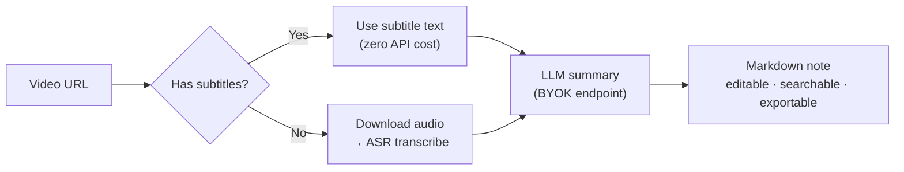
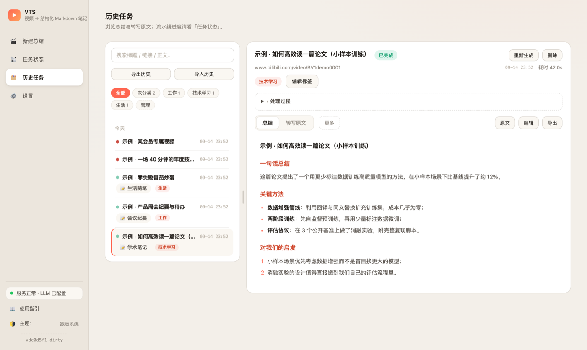

# VTS (Video-To-Summary): Video Summarizer · Video-to-Text · Subtitle Extraction · Markdown Notes

> 中文文档：[`README.md`](README.md)。

  
<!-- Once pushed to GitHub, remove this comment to enable the CI badge (workflow ready: .github/workflows/oss-guard.yml):
[](https://github.com/OWNER/REPO/actions/workflows/oss-guard.yml) -->

**Video URL → structured Markdown notes.** Paste a video link, and VTS fetches the
transcript (or subtitles), runs it through an LLM you configure, and lands an editable,
searchable, exportable Markdown note. Ships with a web console and a CLI.

**Typical use cases**:

- **AI video summaries** — turn long YouTube / Bilibili videos into structured notes;
- **Video-to-text & subtitle extraction** — transcripts and `.srt` files for lectures,
  talks, and interviews;
- **Podcast transcription** — archive local audio as searchable text notes;
- **Meeting & course knowledge base** — labeled, full-text-searchable personal notes.

> **Subtitle-first.** When a video has subtitles (human or platform-generated), VTS uses
> the subtitle text directly as the transcript — no audio download, no transcription API
> call. Transcription (ASR) setup is only needed for videos without subtitles. LLM
> summarization requires your own key (BYOK, any OpenAI-compatible endpoint): without
> one, summarization is skipped and only the raw transcript is produced — the job still
> succeeds.

- **Self-hosted** — videos, notes, and the database stay on your own machine;
- **BYOK (Bring Your Own Key)** — not tied to any model vendor. Any **OpenAI-compatible**
  endpoint works: OpenAI, DeepSeek, Moonshot, a self-hosted vLLM/Ollama gateway… just set
  `base_url` / `api_key` / `model`.
- **Web console** — job list, live progress, in-place artifact editing, labels,
  full-text search, template management.
- **MIT licensed** — core features fully open source. No gating, no trial limits, no
  paywalled features.

**Contents**: [Features](#features) · [Quick start](#quick-start) · [Configuration](#configuration) ·
[Data & backups](#data--backups) · [Advanced](#advanced) ·
[Non-goals](#what-vts-deliberately-does-not-include) · [Reference](#reference-doc-map) ·
[Development](#development) · [FAQ](#faq)




<p align="center"><sub>Web console: job status, live progress, in-place artifact editing, full-text search (screenshot shows sample data)</sub></p>

---

## Features

| Capability | Benefit |
|---|---|
| Subtitle-first | Videos with subtitles produce notes at **zero API cost** — no audio download, no transcription; `--subtitle-preference` switches to `manual_only` / `off`, language via `--subtitle-language` (Chinese-first by default) |
| Transcription | Only needed for videos without subtitles: point at any OpenAI-compatible Whisper endpoint, no local models to install |
| LLM summarization | 10 built-in templates to switch style instantly — the Chinese names are the literal values `--summary-template` accepts: 通用 (General) / 精简笔记 (Concise) / 详细笔记 (Detailed) / 教程笔记 (Tutorial) / 学术笔记 (Academic) / 会议纪要 (Meeting minutes) / 商业分析 (Business analysis) / 小红书笔记 (Xiaohongshu-style) / 生活随笔 (Life notes) / 任务清单 (Task list) — or fully custom templates |
| Job management | Close the tab, restart the service — nothing is lost: live progress, cancel, retry (with a different template), resume after restart, replayable events |
| History & search | label system (rename / merge / delete) + SQLite FTS5 full-text search with highlighted hits — find that one sentence across hundreds of jobs; falls back to LIKE automatically when FTS5 is unavailable |
| Artifacts | Everything is plain files you can take with you: `.summary.md` editable in place (atomic write-back), `.txt` / `.srt` / `.segments.json` |
| Export & migration | per-job Markdown export (real attachment); the whole history packs into one zip — migrating machines loses nothing |
| Diagnostics | one-click sanitized diagnostic log export (keys / Bearer / cookies pseudonymized) — report bugs without leaking secrets |
| Security | API keys Fernet-encrypted at rest; artifact path-traversal guard; optional Bearer-token auth; no-cache static assets |

---

## Quick start

Pick one of the two routes; which configuration you need depends on whether the video has
subtitles — see [Configuration](#configuration).

### Option A: Docker (recommended — no local Python/Node needed)

```bash
# No clone, no build: run the prebuilt image (amd64 / arm64) pushed to ghcr.io
# by the release pipeline
docker run -d --name vts -p 8080:8080 \
  -v vts_data:/data -v vts_output:/output \
  --restart unless-stopped \
  ghcr.io/soloworktop/vts:latest

# Or, with the repository cloned, build from source in one command
docker compose -f docker/docker-compose.yml up -d --build
```

Open <http://127.0.0.1:8080> for the console; health check at `/api/v1/health`. Data lives
in the `vts_data` / `vts_output` volumes and survives container removal / `down`. Image
tags (`latest` or `vX.Y.Z` matching a Release), environment configuration, upgrades, and
the Bilibili 412 playbook: `docker/README.md`.

### Option B: local venv

Requires **Python 3.10+**; ffmpeg is only needed when a subtitle-less video must be
transcribed:

- macOS: `brew install ffmpeg`
- Debian / Ubuntu: `sudo apt install ffmpeg`
- Windows: `winget install Gyan.FFmpeg` (or grab a build from [ffmpeg.org](https://ffmpeg.org/download.html) and add it to PATH)

```bash
python3 -m venv .venv
source .venv/bin/activate                 # Windows PowerShell: .venv\Scripts\Activate.ps1
pip install -e .
bash scripts/web.sh                      # open http://127.0.0.1:8080
```

> Just want the CLI, no local development? Skip cloning and install the distribution
> wheel from [Releases](https://github.com/soloworktop/vts/releases) (not on PyPI yet):
> `pip install https://github.com/soloworktop/vts/releases/download/v0.1.0/vts-0.1.0-py3-none-any.whl`.
> For the web console, prefer the Docker option above.
>
> Native Windows has no bash: run `python -m video_to_summary.main` directly, or use WSL.
> `scripts/fetch_ffmpeg.sh` is only for macOS app bundling — install ffmpeg via a package
> manager for daily use.

### CLI usage

`vts` is installed along with the package, equivalent to
`python -m video_to_summary.main`; see `vts --help` for all options:

```bash
vts "<video-url>"
# The simplest form. With subtitles, no transcription setup is needed; LLM
# summarization requires an LLM key (see "Configuration"). Without a key,
# only the raw transcript is produced.

vts "<video-url>" --summary-template 学术笔记
# Optional: pick a summary template — see vts --help for the list (the
# values are the Chinese template names shown in the table above).

vts "<video-url>" --summary-key sk-xxx --summary-base-url https://api.deepseek.com/v1 --summary-model deepseek-chat
# Optional: bring your own LLM for the summary. Tired of typing? Put it in .env
# (next section) and go back to the first command.

bash scripts/run.sh "<video-url>"
# One-liner alternative: creates the venv, installs deps, then runs the CLI.
```

Success looks like the last line `summary -> output/<job-id>/xxx.summary.md`; artifacts
land in `output/`: summary `.summary.md`, transcript `.txt`, subtitles `.srt`.

VTS also ships a built-in user guide: <http://127.0.0.1:8080/guide>. For more scripted
examples see `examples/` (basic URL / local audio / custom backend / skill integration).

---

## Configuration

Which configuration you need depends on the video:

| Video | Configuration | Result |
|---|---|---|
| Has subtitles | LLM key | Full note (transcript + summary) |
| Has subtitles | none | Raw transcript only (`.txt` / `.srt`), summarization skipped |
| No subtitles | ASR transcription config + LLM key | Full note |
| No subtitles | no ASR config | Job ends with an actionable configuration error |

### Configuring an LLM (required for summarization)

Put defaults in a `.env` (copy from `.env.example`). VTS searches for `.env`
**upward from the directory you run the command in** — put it next to where you invoke
`vts` (or in a parent such as your home directory); it does not have to be in a repository
root. Variables are named per slot; the text slot is the `SUMMARY_*` triplet (legacy
`LLM_*` / `OPENAI_API_KEY` names are still recognized):

```ini
SUMMARY_API_KEY=sk-xxx
SUMMARY_BASE_URL=https://api.deepseek.com/v1
SUMMARY_MODEL=deepseek-chat
```

Or configure via the HTTP API (keys are encrypted at rest; the API only returns masked
values). LLM config has exactly two slots: a **text model** and a **speech recognition
model** (transcribes audio when a video has no subtitles — the ASR config below):

```bash
curl -X PUT localhost:8080/api/v1/llm -H 'Content-Type: application/json' \
  -d '{"summary":{"base_url":"https://api.deepseek.com/v1","api_key":"sk-xxx","model":"deepseek-chat"},
       "asr":{"base_url":"https://api.openai.com/v1","api_key":"sk-xxx","model":"whisper-1"}}'
```

> **No key yet? The job still succeeds:** you get the raw transcript (`.txt` / `.srt`);
> add a key and hit "Regenerate" for the full note.

### ASR configuration (transcription, only needed when a video has no subtitles)

Any OpenAI-compatible endpoint implementing `/audio/transcriptions` works for
transcription. The transcription slot uses the same triplet shape:
`ASR_API_KEY` / `ASR_BASE_URL` / `ASR_MODEL`.

**Using OpenAI official** (simplest): put your key in `.env` and you're done:

```ini
ASR_API_KEY=sk-xxx
```

**Using a third-party / self-hosted endpoint**: add two more lines pointing at it. The key
still goes in `ASR_API_KEY` — use the key **that endpoint issued to you**:

```ini
ASR_BASE_URL=https://your-gateway/v1   # your transcription endpoint
ASR_MODEL=whisper-1                    # model name required by that endpoint (defaults to whisper-1 when unset)
```

**Prefer CLI flags?** Everything above has a command-line equivalent:

```bash
vts "<video-url>" --asr-key sk-xxx
vts "<video-url>" --asr-key sk-xxx --asr-base-url https://your-gateway/v1 --asr-model whisper-1
```

### Content behind login

Bilibili AI/CC subtitles, YouTube auto-generated subtitles, and member-only content
usually require a logged-in session. No site login integration is built in — two ways to
provide it:

1. **cookies file**: `--cookies cookies.txt` (CLI) or the `VTS_COOKIES_FILE` environment
   variable. `cookies.txt` is Netscape format — export it from a logged-in browser with an
   extension such as "Get cookies.txt LOCALLY"; or skip the file entirely and let yt-dlp
   read the browser directly: `yt-dlp --cookies-from-browser chrome "<video-url>"`;
2. **browser cookies**: web console → Settings → Network & Access → "browser cookies" —
   reads your local browser's login state. The first Chrome-family read triggers a macOS
   Keychain prompt; unavailable inside Docker — use option 1 there.

The two are mutually exclusive; an explicit cookies file wins.

---

## Data & backups

The SQLite database `app.db` (job history, labels, templates, encrypted LLM keys) defaults
to:

- **Source checkout / editable install** (`pip install -e .`): `<checkout-root>/data/app.db`
- **Installed as a package** (non-editable): the platform user data dir — macOS
  `~/Library/Application Support/VTS/app.db`, Windows `%LOCALAPPDATA%\VTS\app.db`,
  Linux etc. `$XDG_DATA_HOME/vts/app.db` (`~/.local/share/vts/app.db` when `XDG_DATA_HOME`
  is unset)

Any form can be overridden with `VIDEO_TO_SUMMARY_DB` (Docker already defaults to
`/data/app.db`); missing directories are created automatically, and on failure you get an
actionable error asking you to set the variable. The resolved path shows up in the
`sqlite database ready at ...` startup log line; how the two forms are told apart:
`docs/configuration.md` (Chinese).

**Backup / migration**: stop the service, then copy `app.db` (together with the sibling
`enc_key` file) and the whole `output/` directory to the same location in the new
environment; in Docker they correspond to the `vts_data` / `vts_output` volumes. Export
tips: `docker/README.md` (Data persistence).

---

## Advanced

### Custom static directory (`VTS_STATIC_DIR`)

By default the web console serves the frontend bundled with the package (built from
`web-src/`). To serve your own frontend build instead — a customized UI, or co-deploying
frontend and backend in one process — point the `VTS_STATIC_DIR` environment variable at a
directory **containing `index.html`**:

```bash
VTS_STATIC_DIR=/path/to/my-frontend bash scripts/web.sh
# Docker: set it in the compose environment and mount the host directory into the container
```

When active, `/` and `/static/*` are served from that directory (caching semantics
unchanged; put the complete build output there — `index.html` + `assets/` etc.). When
unset or invalid (missing / no `index.html`), VTS falls back to the bundled directory and
logs one warning — a misconfigured path never blanks the page. The `/api/v1` API, the
`/guide` manual, and the health check are unaffected.

### Plugins & extensions

The core only defines mount points (`RouteProvider` / `JobSideEffect` / `SettingsProvider`);
third-party plugins hook in through a standard entry point, and the core never references
any concrete plugin package name. Capabilities are exposed via `GET /api/v1/capabilities`;
this build ships no plugins, so the response is `{}`. Entry-point wiring, capability
declaration, and the fail-closed rules: `docs/plugins.md` (Chinese).

### Version injection (external-build friendly)

Set the `VIDEO_TO_SUMMARY_VERSION` environment variable (non-empty → used as-is) to inject
a custom version, shown in `/api/v1/health` `version` and CLI `--version`. Resolution
order and details: `docs/configuration.md` (Chinese).

---

## What VTS deliberately does not include

VTS is intentionally single-user and BYOK-only; the following are out of scope for the
core:

- **No local transcription engine** — transcription goes through an OpenAI-compatible
  Whisper API you configure; no local model downloads.
- **No built-in site login integration** — provide login state yourself via cookies
  (see Configuration above).
- **No PDF export** — artifacts are Markdown; full-history export/import is zip.
- **Single-user** — no accounts, no multi-tenancy, no usage dashboards.
- **No gating** — no trials, no watermarks, no paywalls.

Some of these (e.g. PDF export) can be added via the plugin mount point; replacing the
transcription engine has no mount point today. The full scope rationale lives in
`CONTRIBUTING.md` (Scope declaration, Chinese).

---

## Reference (doc map)

The canonical API prefix is **`/api/v1`**. Go deeper as needed:

| Document | Contents |
|---|---|
| [Built-in user guide](http://127.0.0.1:8080/guide) | illustrated daily-usage manual (served by the app) |
| [`docs/api.md`](docs/api.md) | full HTTP API table (34 endpoints) and `VIDEO_TO_SUMMARY_TOKEN` auth — **must** be configured before LAN/public exposure |
| [`docs/configuration.md`](docs/configuration.md) | full environment-variable semantics (incl. legacy aliases), data-location rules, version injection |
| [`docs/plugins.md`](docs/plugins.md) | plugin mount points, entry-point wiring, capability declaration |
| [`docker/README.md`](docker/README.md) | Docker deployment, configuration, upgrades, network & risk control (Bilibili 412) |
| [`.env.example`](.env.example) | annotated example for every environment variable |
| [`SECURITY.md`](SECURITY.md) | how to report vulnerabilities & self-hosting security notes |
| [`CONTRIBUTING.md`](CONTRIBUTING.md) / [`AGENTS.md`](AGENTS.md) | contribution process & scope declaration / repo conventions |

---

## Development

```bash
pip install -e ".[dev]"
python -m pytest -q                    # offline by default; network cases need VTS_NETWORK_TESTS=1
pip install -e ".[e2e]" && playwright install chromium
bash scripts/e2e.sh                    # end-to-end (real uvicorn + in-process fakes)
bash scripts/e2e.sh live               # live-boundary end-to-end (real download/transcribe/LLM; needs keys in .env, skipped by default)
```

Before running the test suite locally for the first time, build the frontend:
`cd web-src && pnpm install && pnpm build` (CI builds it automatically; without a built
frontend the static-file test fails with a 404 — an environment prerequisite, not a
regression).

Repo conventions: `AGENTS.md`. Contribution scope and process: `CONTRIBUTING.md`.

---

## FAQ

### Bilibili videos fail with HTTP 412 / no subtitles?

**HTTP 412** is a challenge from Bilibili's edge WAF (site firewall) on video pages,
keyed on **UA × IP reputation**: yt-dlp's default (browser-like) UA gets blocked, a
non-browser UA recovers. **Missing subtitles** usually means the CC/AI subtitles need a
logged-in session, and the Web/Docker form has no local browser. Pick one fix:

1. Custom User-Agent: set env `VTS_USER_AGENT=Wget/1.21.3` (applies to CLI / Web / Docker; unset keeps default behavior);
2. Login cookies: set env `VTS_COOKIES_FILE` to a cookies.txt path (equivalent to CLI `--cookies`; also unlocks Bilibili CC/AI subtitles);
3. Proxy: configure one in Settings → Network & Access (Web), or pass `--proxy` (CLI).

Full background and compose examples: `docker/README.md` → "网络与风控（B 站 412 等）"
(Network & risk control).

### Asked to install ffmpeg / ffprobe — is it required?

Only the "no subtitles → download audio → transcribe" path uses it; videos with subtitles
never touch it. If a transcription error mentions ffmpeg / ffprobe, install it per
[Quick start](#quick-start) and run again (macOS `brew install ffmpeg`,
Debian/Ubuntu `sudo apt install ffmpeg`, Windows `winget install Gyan.FFmpeg`).

### Port 8080 is taken

`bash scripts/web.sh` automatically advances to the next free port — trust the actual URL
printed in the startup log. To pin a port: `PORT=8090 bash scripts/web.sh` or
`bash scripts/web.sh --port 8090`.

### How do I back up / migrate my data?

Stop the service, then copy `app.db` (together with the sibling `enc_key`) and the whole
`output/` directory; in Docker they are the `vts_data` / `vts_output` volumes, and `down`
without `-v` never deletes volumes. You can also point `VIDEO_TO_SUMMARY_DB` at the new
path. See Data & backups above.

### How do I upgrade / uninstall?

- **Upgrade**: source form — `git pull && pip install -e .`, then restart (the database
  migrates automatically on startup; if the DB schema is newer than the app,
  `/api/v1/health` says so). Docker — after updating the code, run `up -d --build` again
  (data lives in the volumes and survives upgrades); see `docker/README.md`.
- **Uninstall**: source form — delete the checkout and the virtualenv (data locations:
  Data & backups above); Docker — `docker compose down` stops the service and keeps the
  volumes; for a thorough cleanup (volumes / images) see `docker/README.md`.

### Why is the command `vts` but the import package `video_to_summary`?

The distribution and project name is **VTS**; the Python import package stays
**`video_to_summary`** (`from video_to_summary import Settings, run`). The historical
package name is kept because a rename would break every existing usage and downstream
dependency — the cost outweighs the benefit. Install via the distribution name
`pip install vts` — not yet published on PyPI, usable once released; for now install the
wheel attached to a [Release](https://github.com/soloworktop/vts/releases), or use
`pip install -e .` for local development.

---

## Disclaimer

This tool is for personal learning and research only. Please respect the terms of service
and copyright of the target platforms: do not download or redistribute content you are not
entitled to. The project contains no DRM/paywall-bypass capability and no bundled
credentials.

## Acknowledgements

Built on and grateful for these open-source projects:
[yt-dlp](https://github.com/yt-dlp/yt-dlp) (video info & subtitles),
[FastAPI](https://github.com/fastapi/fastapi) / [uvicorn](https://github.com/encode/uvicorn) (web service),
[openai-python](https://github.com/openai/openai-python) (OpenAI-compatible client),
[cryptography](https://github.com/pyca/cryptography) (key encryption), and the
React + Vite frontend toolchain.

## License

[MIT](LICENSE) © 2026 soloworktop
