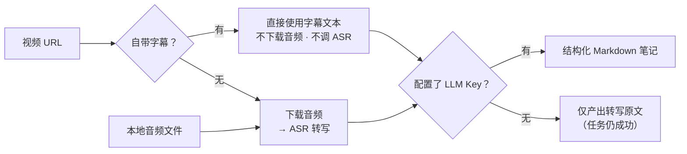

# VTS — Video to Summary

> 把视频链接（YouTube / B 站等任意 yt-dlp 支持的站点）或本地音频，变成结构化 Markdown 笔记。

**字幕优先 · 本地自部署 · BYOK（自带 Key）· Markdown-first**


[](https://github.com/soloworktop/vts/actions/workflows/oss-guard.yml)
[](https://github.com/soloworktop/vts/releases)

> English documentation: [`README.en.md`](README.en.md)


<p align="center"><sub>Web 控制台：任务状态、实时进度、产物在线编辑与全文检索（截图为示例数据）</sub></p>

---

## 为什么是 VTS

VTS 面向想把长视频变成可复用的个人知识、又不想依赖第三方 SaaS 的人：

- **字幕优先**：视频自带字幕（人工或平台自动）时，直接把字幕文本当转写稿——不下载
  音频、不调用转写接口；
- **本地优先**：VTS 不托管你的数据——任务、数据库与产物都由你自己的机器管理。使用
  云端 ASR / LLM 时，相应音频或文本会发送到你配置的服务（见「[安全](#安全)」）；
- **BYOK（Bring Your Own Key）**：不绑定模型供应商。LLM 总结走任意 **OpenAI 兼容**
  接口——OpenAI、DeepSeek、Moonshot、自建 vLLM / Ollama 网关……；无字幕视频的转写
  （ASR）走实现了 `/audio/transcriptions` 的兼容端点。两者都只需填 `base_url` /
  `api_key` / `model`；
- **Markdown-first**：产物是普通文件（Markdown / TXT / SRT），可编辑、可检索、可版本
  化、可整体带走；
- **开放与可迁移**：MIT 开源，Web 控制台与 CLI 双形态；数据与产物是不绑定任何特定
  服务的标准文件，可随时导出、迁移。

## 核心特性

| 能力 | 说明 |
|---|---|
| 字幕优先 | 有字幕直接用字幕出稿，不下载音频、不调 ASR |
| 视频转写 | 无字幕时经你配置的 OpenAI 兼容 Whisper API 转写，不装本地模型 |
| AI 总结 | 10 种内置模板一键换风格（见「[命令行](#命令行)」），也可在 Web 中自定义模板 |
| 任务管理 | 实时进度、可取消、可重试（可换模板）、重启自动恢复 |
| 笔记管理 | 产物在线编辑、标签体系、全文检索与命中高亮 |
| 导出与迁移 | 单任务导出 Markdown、全部历史打包 zip；产物为 `.summary.md` / `.txt` / `.srt` / `.segments.json` |
| 本地部署 | 数据保存在自己的机器；Docker 一键起服务 |
| 安全 | API Key 加密落库、产物路径防逃逸、可选 Bearer Token 鉴权、一键导出脱敏诊断日志 |

## 工作原理



- **字幕优先**：URL 视频自带字幕时直接使用字幕文本当转写稿，不下载音频、不调用 ASR
  ——更快，也没有转写失真；
- **没配 LLM Key 也不是失败**：跳过总结，仍产出转写原文（`.txt` / `.srt`）；之后补上
  Key 点「重新生成」即可拿到完整笔记。

---

## 快速开始

### Docker（推荐）

```bash
docker run -d --name vts -p 8080:8080 \
  -v vts_data:/data -v vts_output:/output \
  --restart unless-stopped \
  ghcr.io/soloworktop/vts:latest

# 已克隆仓库时，也可源码构建一键起服务：
docker compose -f docker/docker-compose.yml up -d --build
```

打开 <http://127.0.0.1:8080> 即是控制台（健康检查在 `/api/v1/health`）。数据存在
`vts_data` / `vts_output` 两个卷里，删容器、`down` 都不丢；镜像标签、端口冲突、升级
与 B 站 412 风控见 [`docker/README.md`](docker/README.md)。

**第一次任务（5 分钟）**：

1. 「设置 → LLM 配置」填入你的 OpenAI 兼容端点与 Key（有字幕的视频只需这一步）；
2. 「新建任务」粘贴视频链接，选一个总结模板（默认「通用」即可）；
3. 点开始，实时查看进度；
4. 完成后得到 Markdown 笔记，可在线编辑、打标签、全文检索。

### 本地运行（venv）

需要 **Python 3.10+**；ffmpeg 仅在「视频无字幕、需要转写」时用到
（见[常见问题](#常见问题)）：

- macOS：`brew install ffmpeg` · Debian / Ubuntu：`sudo apt install ffmpeg` ·
  Windows：`winget install Gyan.FFmpeg`

```bash
python3 -m venv .venv
source .venv/bin/activate                 # Windows PowerShell：.venv\Scripts\Activate.ps1
pip install -e .
bash scripts/web.sh                      # 打开 http://127.0.0.1:8080
```

> 只想用 CLI、不做本地开发？直接安装
> [Release](https://github.com/soloworktop/vts/releases) 里的发行包（尚未发布 PyPI）：
> `pip install https://github.com/soloworktop/vts/releases/download/v0.1.0/vts-0.1.0-py3-none-any.whl`。
> 原生 Windows 没有 bash：直接运行 `python -m video_to_summary.main`，或使用 WSL。

---

## 输出是什么

VTS 的产物全部是标准文件，可编辑、可检索、可版本化、可整体迁移。Web / Docker 形态下
每个任务一个子目录（`VIDEO_TO_SUMMARY_OUTPUT_DIR` 可改基目录）：

```text
output/
└── <任务ID>/
    ├── <内容ID>.summary.md     # 结构化 Markdown 笔记（必有，可在线编辑）
    ├── <内容ID>.txt            # 转写原文（必有）
    ├── <内容ID>.srt            # SRT 字幕（字幕 / 转写含时间轴时生成）
    ├── <内容ID>.segments.json  # 分段数据（含时间轴时生成）
    └── <内容ID>.polished.txt   # 润色稿（启用文本润色时生成）
```

文件名前缀 `<内容ID>`：URL 源是视频 ID，本地文件是原文件名。CLI 形态没有任务子目录，
文件直接写在 `output/`（`--output-dir` 可改）。

`.summary.md` 的固定结构如下。**注意：以下为结构示例**——标题、来源与正文均为占位
演示，不是真实运行结果；正文按「通用」模板的典型组织方式排布（先核心结论，再按主题
分节，保留关键数字与可执行建议）：

```markdown
# 视频标题

- **来源**：<视频链接>
- **时长**：38分钟

## 摘要

<LLM 生成的总结正文：先一句话核心结论，再按主题分节展开>

## 关键观点

### 1. <观点一>

<支撑论据与关键数据>

### 2. <观点二>

<支撑论据与关键数据>

## 可执行建议

- <建议一>
- <建议二>
```

---

## 配置

按视频情况与需求渐进配置，需要什么配什么：

| 视频 | 需要配置 | 结果 |
|---|---|---|
| 有字幕 | LLM Key | 完整笔记（转写稿 + 总结） |
| 有字幕 | 无 | 仅转写原文（`.txt` / `.srt`），任务成功 |
| 无字幕 | ASR 转写配置 + LLM Key | 完整笔记 |
| 无字幕 | 无 ASR 配置 | 任务以引导配置的报错结束 |

### 最小配置：LLM Key（有字幕视频只需这一步）

把配置写进 `.env`（可从 [`.env.example`](.env.example) 复制）。VTS 从**运行命令时所在
目录**向上查找 `.env`，放在你平时执行 `vts` 的目录（或其上层，如家目录）即可。推理槽
是 `SUMMARY_*` 三元组（旧名 `LLM_*` / `OPENAI_API_KEY` 仍被识别）：

```ini
SUMMARY_API_KEY=sk-xxx
SUMMARY_BASE_URL=https://api.deepseek.com/v1
SUMMARY_MODEL=deepseek-chat
```

Web 控制台也可视化配置（「设置 → LLM 配置」），或走 HTTP 接口——Key 加密落库，接口
只回掩码值：

```bash
curl -X PUT localhost:8080/api/v1/llm -H 'Content-Type: application/json' \
  -d '{"summary":{"base_url":"https://api.deepseek.com/v1","api_key":"sk-xxx","model":"deepseek-chat"},
       "asr":{"base_url":"https://api.openai.com/v1","api_key":"sk-xxx","model":"whisper-1"}}'
```

> **没配 Key 任务也不会失败**：仍产出转写原文，补上 Key 后点「重新生成」即可拿到
> 完整笔记。

### 无字幕视频：加配 ASR

任何实现了 `/audio/transcriptions` 的 OpenAI 兼容端点都可以做转写，转写槽同样是
三元组：

```ini
ASR_API_KEY=sk-xxx                     # 用 OpenAI 官方转写时有这一行就够
ASR_BASE_URL=https://your-gateway/v1   # 第三方 / 自建端点时补这两行
ASR_MODEL=whisper-1                    # 该端点要求的模型名，未设置时默认 whisper-1
```

CLI 等价参数：`vts "<视频链接>" --asr-key sk-xxx [--asr-base-url … --asr-model …]`。

### 需要登录的内容

B 站 AI/CC 字幕、YouTube 自动字幕与会员内容通常需要登录态。VTS 不内置站点登录集成，
两种提供方式（互斥，显式 cookies 文件优先）：

1. **cookies 文件**：CLI `--cookies cookies.txt` 或环境变量 `VTS_COOKIES_FILE`。
   cookies.txt 是 Netscape 格式，可用浏览器扩展（如「Get cookies.txt LOCALLY」）在
   已登录的浏览器里导出；
2. **浏览器 cookies**：Web「设置 → 网络与访问」选择「浏览器 cookies」，直接读取本机
   浏览器的登录态。Chrome 系首次读取会弹 macOS 钥匙串授权；Docker 内不可用，请用
   方式 1。

### 全部配置项

环境变量全量语义（含兼容别名）、数据位置判据、版本注入见
[`docs/configuration.md`](docs/configuration.md)；Docker 部署语境（卷、端口、镜像源）
见 [`docker/README.md`](docker/README.md)。

---

## 命令行

`vts` 是安装后自带的命令，等价于 `python -m video_to_summary.main`：

```bash
vts "<视频链接>"
# 最简用法。有字幕时无需转写配置即可跑通；未配 LLM Key 时仅产出转写原文。

vts "<视频链接>" --summary-template 学术笔记
# 换总结模板。

vts "<视频链接>" --summary-key sk-xxx --summary-base-url https://api.deepseek.com/v1 --summary-model deepseek-chat
# 临时接入自己的 LLM；长期使用建议写进 .env（见「配置」）。

bash scripts/run.sh "<视频链接>"
# 免手动建环境：自动建 venv + 装依赖再调用，参数同上。
```

内置 10 种总结模板（CLI 只接受内置名，Web 中还可自定义）：`通用`（默认）/
`精简笔记` / `详细笔记` / `教程笔记` / `学术笔记` / `会议纪要` / `商业分析` /
`小红书笔记` / `生活随笔` / `任务清单`。

跑通的标志是终端最后一行输出 `summary -> output/<内容ID>.summary.md`。全部参数见
[`docs/cli.md`](docs/cli.md) 与 `vts --help`；脚本化调用示例见
[`examples/`](examples/)。

---

## 数据与备份

SQLite 数据库 `app.db`（任务历史、标签、模板、加密后的 Key）默认位置：

- **源码检出 / editable 安装**（`pip install -e .`）：`<检出根>/data/app.db`
- **安装为包**（非 editable）：平台用户数据目录——macOS
  `~/Library/Application Support/VTS/`、Windows `%LOCALAPPDATA%\VTS\`、Linux 等
  `$XDG_DATA_HOME/vts/`

任意形态都可用 `VIDEO_TO_SUMMARY_DB` 覆盖（Docker 已默认 `/data/app.db`）。

**备份 / 迁移**：停服务后拷走 `app.db`（连同同目录的 `enc_key` 密钥文件）与整个
`output/` 产物目录，放到新环境同位置即可；Docker 形态对应 `vts_data` / `vts_output`
两个卷，导出方法见 `docker/README.md`「数据持久化」。路径判定的完整规则见
[`docs/configuration.md`](docs/configuration.md)。

---

## 文档地图

| 我想… | 看这里 |
|---|---|
| 快速上手 | 本页「[快速开始](#快速开始)」 |
| 日常使用（图文手册） | 服务自带：<http://127.0.0.1:8080/guide> |
| 用 Docker 部署 / 升级 / 解决 B 站 412 | [`docker/README.md`](docker/README.md) |
| 配置 LLM / ASR / 查全部环境变量 | [`docs/configuration.md`](docs/configuration.md) / [`.env.example`](.env.example) |
| 调 HTTP API | [`docs/api.md`](docs/api.md)（canonical 前缀 `/api/v1`，含 `VIDEO_TO_SUMMARY_TOKEN` 鉴权） |
| 查 CLI 全部参数 | [`docs/cli.md`](docs/cli.md) / `vts --help` |
| 写插件、做能力扩展 | [`docs/plugins.md`](docs/plugins.md)（能力经 `GET /api/v1/capabilities` 对外暴露） |
| 加固部署 / 报告漏洞 | [`SECURITY.md`](SECURITY.md) |
| 参与贡献 | [`CONTRIBUTING.md`](CONTRIBUTING.md) |
| 了解仓库约定（贡献者 / Agent） | [`AGENTS.md`](AGENTS.md) |

---

## 安全

VTS 为**个人自部署**设计，默认只监听本机。要把服务暴露到局域网 / 公网，**必须**先
设置 `VIDEO_TO_SUMMARY_TOKEN` 启用 Bearer 鉴权（详见
[`docs/api.md`](docs/api.md)）。

- VTS 本身不提供云端存储：任务、数据库与产物都在你自己的机器上；但使用第三方
  ASR / LLM API 时，相应的音频或文本会发送给你配置的服务商，具体取决于你的配置与
  对方的数据政策；
- API Key 经 Fernet 加密落库，接口只回掩码值，不会明文返回；
- cookies 等同账号凭据：注意保管，不要提交进仓库、不要写进会外发的文件；
- 漏洞报告渠道与自部署加固要点见 [`SECURITY.md`](SECURITY.md)。

---

## VTS 明确不做的事

VTS 刻意保持单用户、BYOK 形态，以下能力不在核心范围内：

- **不内置本地转写**——转写只走你配置的 OpenAI 兼容 Whisper API，不下载本地模型；
- **不内置站点登录集成**——需要登录态的内容用 cookies 自行提供（见「配置」）；
- **无 PDF 导出**——产物导出为 Markdown；历史整体导出 / 导入为 zip；
- **单用户**——无账号体系、无多租户、无用量看板；
- **产物不加水印**——输出即原始标准文件，不注入任何水印。

其中部分（如 PDF 导出）可经插件挂载点扩展。完整的范围取舍依据见
`CONTRIBUTING.md`「范围宣言」。

---

## 开发

```bash
pip install -e ".[dev]"
python -m pytest -q                    # 默认全离线；联网用例需 VTS_NETWORK_TESTS=1
pip install -e ".[e2e]" && playwright install chromium
bash scripts/e2e.sh                    # 端到端（真实 uvicorn + fakes）
bash scripts/e2e.sh live               # 真实边界端到端（真实下载/转写/LLM；需 .env 配 Key，默认跳过）
```

本地首次跑测试前先构建前端：`cd web-src && pnpm install && pnpm build`（CI 会自动构建；
未构建时静态文件用例会以 404 失败，属环境前置而非代码回归）。

仓库约定见 `AGENTS.md`；提交范围与流程见 `CONTRIBUTING.md`。

---

## 常见问题

### B 站视频报 412 / 取不到字幕怎么办？

**412** 通常与 B 站对视频页请求的风控有关：yt-dlp 默认的（浏览器式）UA 更容易被拦，
自定义非浏览器 UA 在常见场景下可恢复，但不保证对所有网络环境都有效。**取不到字幕**
通常是 CC/AI 字幕需要登录态，而 Web/Docker 形态没有本机浏览器。可以依次尝试：

1. 自定义 UA：环境变量 `VTS_USER_AGENT=Wget/1.21.3`（CLI / Web / Docker 均生效；空 = 默认行为不变）；
2. 登录 cookies：环境变量 `VTS_COOKIES_FILE` 指向 cookies.txt（等价 CLI `--cookies`，同时解锁 B 站 CC/AI 字幕）；
3. 代理：Web「设置 → 网络与访问」填代理，或 CLI `--proxy`。

以上方式的效果因网络环境与站点风控策略而异；完整背景与 Docker compose 示例见
`docker/README.md`「网络与风控（B 站 412 等）」。

### 提示需要 ffmpeg / ffprobe，必须装吗？

只在「视频没有自带字幕、需要下载音频转写」的路径用到，有字幕的视频全程不需要。转写报错
提到 ffmpeg / ffprobe 时，按「快速开始」装好再跑即可（macOS `brew install ffmpeg`、
Debian / Ubuntu `sudo apt install ffmpeg`、Windows `winget install Gyan.FFmpeg`）。

### 8080 端口被占用怎么办？

`bash scripts/web.sh` 启动时会自动顺延到下一个空闲端口，以启动日志打印的实际地址为准；
需要固定端口时用 `PORT=8090 bash scripts/web.sh` 或 `bash scripts/web.sh --port 8090`。

### 数据如何备份 / 迁移？

停服务后拷走 `app.db`（连同同目录的 `enc_key`）与整个 `output/` 即可；Docker 对应
`vts_data` / `vts_output` 两个卷，`down` 不带 `-v` 不删卷。也可用 `VIDEO_TO_SUMMARY_DB`
把库指到新路径。详见上文「[数据与备份](#数据与备份)」。

### 如何升级 / 卸载？

- **升级**：源码形态 `git pull && pip install -e .` 后重启即可，启动时自动做数据库迁移
  （数据库 schema 比应用新时 `/api/v1/health` 会给出提示）；Docker 形态更新代码后重新
  `up -d --build`，数据在卷里，升级不丢。细节见 `docker/README.md`。
- **卸载**：源码形态删掉检出目录与虚拟环境即可（数据见上文「数据与备份」）；Docker 形态
  `docker compose down` 停服务、数据保留在卷中，彻底清理（删卷 / 删镜像）见
  `docker/README.md`。

### 为什么命令叫 `vts`，import 包名却是 `video_to_summary`？

发行名与项目名是 **VTS**，Python import 包名保持 **`video_to_summary`**
（`from video_to_summary import Settings, run`）。沿用历史包名是为了不打断所有既有用法与
下游依赖，重命名收益不抵成本。当前的安装方式：源码开发用 `pip install -e .`，或直接装
[Release](https://github.com/soloworktop/vts/releases) 附件里的 wheel；PyPI 安装
（`pip install vts`）要等未来正式发布后才可用。

---

## 免责声明

本工具仅用于个人学习与研究。请遵守目标平台的服务协议与版权规定：不要用它下载或传播
你无权使用的内容。项目不包含任何 DRM/付费墙绕过能力，也不内置任何登录凭据。

## 致谢

依赖并感谢这些开源项目：[yt-dlp](https://github.com/yt-dlp/yt-dlp)（视频信息与字幕提取）、
[FastAPI](https://github.com/fastapi/fastapi) / [uvicorn](https://github.com/encode/uvicorn)（Web 服务）、
[openai-python](https://github.com/openai/openai-python)（OpenAI 兼容客户端）、
[cryptography](https://github.com/pyca/cryptography)（Key 加密存储），以及 React + Vite 前端工具链。

## 许可

[MIT](LICENSE) © 2026 soloworktop
