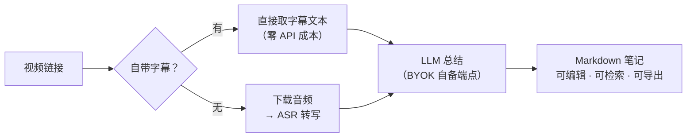

# VTS

> English documentation: [`README.en.md`](README.en.md)

  
<!-- 推送到 GitHub 后删除本行注释并启用 CI 徽章（workflow 已就绪：.github/workflows/oss-guard.yml）：
[](https://github.com/OWNER/REPO/actions/workflows/oss-guard.yml) -->

**视频 URL → 结构化 Markdown 笔记。** 输入一条视频链接，自动取字幕/转写、调用你自己配置的
LLM 生成结构化笔记，并落地为可编辑、可检索、可导出的 Markdown 文件。自带 Web 控制台与 CLI。

为什么做它：看完一小时的视频想留份笔记——手动转录整理要一晚上，云端总结工具要把视频
传到别人的服务器、还按月付费。VTS **本地自部署**，视频不出你的机器；**字幕优先**让自带
字幕的视频零 API 成本出稿，只有无字幕视频才需要额外配一个转写接口。

> **字幕优先。** 视频自带字幕（人工或平台自动）时，直接用字幕文本当转写稿——不下载音频、
> 不调用转写接口；视频没有字幕时，才需要额外配置转写（ASR）。LLM 总结需要配置自己的 Key
> （BYOK，任意 OpenAI 兼容端点）：未配置时跳过总结、仅产出转写原文，任务不算失败。

- **BYOK（Bring Your Own Key）**：不绑定任何模型供应商，任意 **OpenAI 兼容**端点都可以——
  OpenAI、DeepSeek、Moonshot、自建 vLLM/Ollama 网关……填 `base_url` / `api_key` / `model` 即可。
- **Web 控制台**：任务列表、实时进度、产物在线编辑、标签、全文检索、模板管理。
- **MIT 许可**：核心功能全部开源，无门控、无试用限制、无付费解锁。

**目录**：[特性总览](#特性总览) · [快速开始](#快速开始) · [配置](#配置) · [数据与备份](#数据与备份) ·
[进阶](#进阶) · [明确不做的事](#vts-明确不做的事) · [参考](#参考文档地图) · [开发](#开发) · [常见问题](#常见问题)




<p align="center"><sub>Web 控制台：任务状态、实时进度、产物在线编辑与全文检索（截图为示例数据）</sub></p>

---

## 特性总览

| 能力 | 收益 |
|---|---|
| 字幕优先 | 自带字幕的视频**零 API 成本**出稿，不下载音频、不调转写；`--subtitle-preference` 可改 `manual_only` / `off`，`--subtitle-language` 选语言（默认中文优先） |
| 转写 | 只有视频没有字幕时才需要：填一个 OpenAI 兼容 Whisper 端点即可，不用装本地模型 |
| LLM 总结 | 10 种内置模板一键换风格——通用 / 精简笔记 / 详细笔记 / 教程笔记 / 学术笔记 / 会议纪要 / 商业分析 / 小红书笔记 / 生活随笔 / 任务清单——也可以完全自定义 |
| 任务管理 | 关掉页面、重启服务都不丢任务：实时进度、可取消、可重试（可换模板）、重启自动恢复、事件可回放 |
| 历史检索 | 标签体系（重命名 / 合并 / 删除）+ SQLite FTS5 全文检索、命中高亮，几百条历史里秒搜到那句话；环境不支持 FTS5 时自动降级 LIKE，检索不中断 |
| 产物 | 全部是标准文件、随时可拿走：`.summary.md` 可在线编辑（写回原子替换），`.txt` / `.srt` / `.segments.json` |
| 导出与迁移 | 单任务导出 Markdown（真实附件）；全部历史一键打包 zip，换机器不丢数据 |
| 诊断 | 一键导出脱敏诊断日志，Key / Bearer / cookie 自动伪名化，报障不泄密 |
| 安全 | API Key Fernet 加密落库；产物路径防逃逸；可选 Bearer Token 鉴权；静态资源 no-cache |

---

## 快速开始

两条路线二选一；需要哪些配置取决于视频有没有字幕，见「[配置](#配置)」。

### 方式 A：Docker（推荐——不需要本机装 Python / Node）

```bash
docker compose -f docker/docker-compose.yml up -d --build
```

打开 <http://127.0.0.1:8080> 即是控制台，健康检查在 `/api/v1/health`。数据存在
`vts_data` / `vts_output` 两个卷里，`down` 不丢。等价的 `bash scripts/docker.sh up`，
以及环境变量配置、升级、B 站 412 风控等细节见 `docker/README.md`。

### 方式 B：本地 venv

需要 **Python 3.10+**；ffmpeg 仅在视频无字幕、需要转写时用到：

- macOS：`brew install ffmpeg`
- Debian / Ubuntu：`sudo apt install ffmpeg`
- Windows：`winget install Gyan.FFmpeg`（或从 [ffmpeg.org](https://ffmpeg.org/download.html) 下载后加入 PATH）

```bash
python3 -m venv .venv
source .venv/bin/activate                 # Windows PowerShell：.venv\Scripts\Activate.ps1
pip install -e .
bash scripts/web.sh                      # 打开 http://127.0.0.1:8080
```

> 原生 Windows 没有 bash：直接运行 `python -m video_to_summary.main`，或使用 WSL。
> `scripts/fetch_ffmpeg.sh` 仅供 macOS 打包分发，日常装 ffmpeg 用上面的包管理器即可。

### 命令行用法

`vts` 是安装后自带的命令，等价于 `python -m video_to_summary.main`；完整参数见 `vts --help`：

```bash
vts "<视频链接>"
# 最简用法。视频有字幕时无需转写配置即可跑通；LLM 总结需配 LLM Key（见「配置」），未配时仅产出转写原文。

vts "<视频链接>" --summary-template 学术笔记
# 可选：换总结模板。可选值见 vts --help（通用 / 学术笔记 / 会议纪要 等）。

vts "<视频链接>" --summary-key sk-xxx --summary-base-url https://api.deepseek.com/v1 --summary-model deepseek-chat
# 可选：接入自己的 LLM 生成总结。参数较长时可写进 .env（见下节），之后仍然只跑第一条。

bash scripts/run.sh "<视频链接>"
# 嫌手动建环境麻烦：这条会自动建 venv + 装依赖再调用（参数同上）。
```

跑通的标志是终端最后一行输出 `summary -> output/<任务ID>/xxx.summary.md`；产物都在
`output/` 目录：总结 `.summary.md`、转写原文 `.txt`、字幕 `.srt`。

服务自带一份内置使用手册：<http://127.0.0.1:8080/guide>；更多脚本化用法示例见 `examples/`
（基础调用 / 本地音频 / 自定义后端 / 技能集成）。

---

## 配置

按视频情况与需求，需要的配置不同：

| 视频 | 配置 | 结果 |
|---|---|---|
| 有字幕 | LLM Key | 完整笔记（转写稿 + 总结） |
| 有字幕 | 无 | 仅转写原文（`.txt` / `.srt`），跳过总结 |
| 无字幕 | ASR 转写配置 + LLM Key | 完整笔记 |
| 无字幕 | 无 ASR 配置 | 任务以引导配置的报错结束 |

### 配置 LLM（生成总结必需）

把配置写进 `.env`（可从 `.env.example` 复制）。VTS 从**运行命令时所在目录**向上查找
`.env`，放在你平时执行 `vts` 的目录（或其上层，如家目录）即可，不必在仓库根。变量按
槽位命名，推理槽是 `SUMMARY_*` 三元组（旧名 `LLM_*` / `OPENAI_API_KEY` 仍被识别）：

```ini
SUMMARY_API_KEY=sk-xxx
SUMMARY_BASE_URL=https://api.deepseek.com/v1
SUMMARY_MODEL=deepseek-chat
```

也可以走 HTTP 接口配置（Key 加密落库，接口只回掩码值）。LLM 配置只有两个槽位：
**推理模型**与**语音识别模型**（视频无字幕时转写音频，即下文的 ASR）：

```bash
curl -X PUT localhost:8080/api/v1/llm -H 'Content-Type: application/json' \
  -d '{"summary":{"base_url":"https://api.deepseek.com/v1","api_key":"sk-xxx","model":"deepseek-chat"},
       "asr":{"base_url":"https://api.openai.com/v1","api_key":"sk-xxx","model":"whisper-1"}}'
```

> **没配 Key 任务也不会失败**：仍产出转写原文（`.txt` / `.srt`），补上 Key 后点
> 「重新生成」即可拿到完整笔记。

### 配置 ASR（转写，仅视频无字幕时需要）

任何实现了 `/audio/transcriptions` 的 OpenAI 兼容端点都可以做转写。转写槽位同样是
三元组：`ASR_API_KEY` / `ASR_BASE_URL` / `ASR_MODEL`。

**用 OpenAI 官方**（最简单）：把你的 Key 写进 `.env` 就完成了：

```ini
ASR_API_KEY=sk-xxx
```

**用第三方 / 自建端点**：在上面基础上补两行，指向你的端点；Key 仍写在 `ASR_API_KEY`，
填该端点发给你的 Key：

```ini
ASR_BASE_URL=https://your-gateway/v1   # 你的转写端点地址
ASR_MODEL=whisper-1                    # 该端点要求的模型名，未设置时默认 whisper-1
```

**不想改 `.env`**：这些都有对应的命令行参数，跑的时候直接带上即可：

```bash
vts "<视频链接>" --asr-key sk-xxx
vts "<视频链接>" --asr-key sk-xxx --asr-base-url https://your-gateway/v1 --asr-model whisper-1
```

### 需要登录的内容

B 站 AI/CC 字幕、YouTube 自动字幕与会员内容通常需要登录态。本版不内置站点登录集成，
两种提供方式：

1. **cookies 文件**：CLI `--cookies cookies.txt` 或环境变量 `VTS_COOKIES_FILE`。
   cookies.txt 是 Netscape 格式，可用浏览器扩展（如「Get cookies.txt LOCALLY」）在已登录的
   浏览器里导出；也可以不导出文件、让 yt-dlp 直接读浏览器登录态：
   `yt-dlp --cookies-from-browser chrome "<链接>"`；
2. **浏览器 cookies**：Web「设置 → 网络与访问」选择「浏览器 cookies」，直接读取本机浏览器
   的登录态。Chrome 系首次读取会弹 macOS 钥匙串授权；Docker 内不可用，请用方式 1。

两者互斥，显式 cookies 文件优先。

---

## 数据与备份

SQLite 数据库 `app.db`（任务历史、标签、模板、加密后的 LLM Key）的默认位置：

- **源码检出 / editable 安装**（`pip install -e .`）：`<检出根>/data/app.db`
- **安装为包**（非 editable）：平台用户数据目录——macOS
  `~/Library/Application Support/VTS/app.db`、Windows `%LOCALAPPDATA%\VTS\app.db`、
  Linux 等 `$XDG_DATA_HOME/vts/app.db`（未设置 `XDG_DATA_HOME` 时为 `~/.local/share/vts/app.db`）

任意形态都可用 `VIDEO_TO_SUMMARY_DB` 覆盖（Docker 已默认 `/data/app.db`）；目录不存在时
自动创建，创建失败会报错提示设置该变量。解析出的数据库路径见启动日志
`sqlite database ready at ...` 一行；运行形态的判定细节见 `docs/configuration.md`。

**备份 / 迁移**：停服务后拷走 `app.db`（连同同目录的 `enc_key` 密钥文件）与整个 `output/`
产物目录，放到新环境同位置即可；Docker 形态对应 `vts_data` / `vts_output` 两个卷，
导出方法见 `docker/README.md`「数据持久化」。

---

## 进阶

### 自定义前端（`VTS_STATIC_DIR`）

默认服务包内构建好的前端（来自 `web-src/` 的构建产物）。想换成自己构建的前端产物——例如
自定界面，或前后端合并部署到同一服务进程——把环境变量 `VTS_STATIC_DIR` 指向一个**包含
`index.html` 的目录**：

```bash
VTS_STATIC_DIR=/path/to/my-frontend bash scripts/web.sh
# Docker：写进 compose 的 environment，并把宿主目录挂载进容器
```

生效时首页 `/` 与 `/static/*` 改由该目录提供，缓存语义不变，请放入完整构建产物
（`index.html` + `assets/` 等）。未设置或无效（目录不存在 / 缺 `index.html`）时自动回落
包内目录并在日志打一条 warning——配错路径不会白屏。`/api/v1` 接口、`/guide` 使用手册与
健康检查不受影响。

### 插件与扩展

核心只定义挂载点（`RouteProvider` / `JobSideEffect` / `SettingsProvider`），第三方插件经
标准 entry point 挂载，核心代码不引用任何具体插件包名。能力经 `GET /api/v1/capabilities`
对外暴露；本构建不含任何插件，响应为 `{}`。entry point 写法、能力声明与 fail-closed
判据见 `docs/plugins.md`。

### 版本号注入（外部构建友好）

设置环境变量 `VIDEO_TO_SUMMARY_VERSION`（非空即生效）即可让外部构建注入自己的版本号，
展示于 `/api/v1/health` 的 `version` 与 CLI `--version`。解析顺序与实现细节见
`docs/configuration.md`。

---

## VTS 明确不做的事

VTS 刻意保持单用户、BYOK 形态，以下能力不在核心范围内：

- **不内置本地转写**——转写只走你配置的 OpenAI 兼容 Whisper API，不下载本地模型；
- **不内置站点登录集成**——需要登录态的内容用 cookies 自行提供（见上文「配置」）；
- **无 PDF 导出**——产物导出为 Markdown；历史整体导出 / 导入为 zip；
- **单用户**——无账号体系、无多租户、无用量看板；
- **无门控**——无试用限制、无水印、无付费解锁。

其中部分（如 PDF 导出）可经插件挂载点扩展；本地转写引擎替换暂无对应挂载点。完整的
范围取舍依据见 `CONTRIBUTING.md`「范围宣言」。

---

## 参考（文档地图）

canonical API 前缀为 **`/api/v1`**。不同深度的内容按需进入：

| 文档 | 内容 |
|---|---|
| [服务内使用手册](http://127.0.0.1:8080/guide) | 面向日常使用的图文手册（随服务自带） |
| [`docs/api.md`](docs/api.md) | HTTP API 全表（34 个端点）与 `VIDEO_TO_SUMMARY_TOKEN` 鉴权——暴露局域网 / 公网前**必须**配置 |
| [`docs/configuration.md`](docs/configuration.md) | 环境变量全量语义（含兼容别名）、数据位置判据、版本号注入 |
| [`docs/plugins.md`](docs/plugins.md) | 插件挂载点、entry point 写法与能力声明 |
| [`docker/README.md`](docker/README.md) | Docker 部署、配置、升级与网络风控（B 站 412） |
| [`.env.example`](.env.example) | 全部环境变量的带注释示例 |
| [`SECURITY.md`](SECURITY.md) | 安全漏洞报告渠道与自部署安全要点 |
| [`CONTRIBUTING.md`](CONTRIBUTING.md) / [`AGENTS.md`](AGENTS.md) | 贡献流程与范围宣言 / 仓库约定 |

---

## 开发

```bash
pip install -e ".[dev]"
python -m pytest -q                    # 默认全离线；联网用例需 VTS_NETWORK_TESTS=1
pip install -e ".[e2e]" && playwright install chromium
bash scripts/e2e.sh                    # 端到端（真实 uvicorn + fakes）
bash scripts/e2e.sh live               # 真实边界端到端（真实下载/转写/LLM；需 .env 配 Key，默认跳过）
```

本地首次跑测试前先构建前端：`cd web-src && pnpm install && pnpm build`（CI 会自动构建；
未构建时静态文件用例会以 404 失败，属环境前置而非代码回归）。

仓库约定见 `AGENTS.md`；提交范围与流程见 `CONTRIBUTING.md`。

---

## 常见问题

### B 站视频报 412 / 取不到字幕怎么办？

**412** 是 B 站边缘 WAF（站点防火墙）按「UA × IP 信誉」对视频页发起的挑战：yt-dlp 默认
（浏览器式）UA 会被拦截，换成非浏览器 UA 即恢复。**取不到字幕**通常是 CC/AI 字幕需要
登录态，而 Web/Docker 形态没有本机浏览器。解法任选其一：

1. 自定义 UA：环境变量 `VTS_USER_AGENT=Wget/1.21.3`（CLI / Web / Docker 均生效；空 = 默认行为不变）；
2. 登录 cookies：环境变量 `VTS_COOKIES_FILE` 指向 cookies.txt（等价 CLI `--cookies`，同时解锁 B 站 CC/AI 字幕）；
3. 代理：Web「设置 → 网络与访问」填代理，或 CLI `--proxy`。

完整原理与 Docker compose 示例见 `docker/README.md`「网络与风控（B 站 412 等）」。

### 提示需要 ffmpeg / ffprobe，必须装吗？

只在「视频没有自带字幕、需要下载音频转写」的路径用到，有字幕的视频全程不需要。转写报错
提到 ffmpeg / ffprobe 时，按「快速开始」装好再跑即可（macOS `brew install ffmpeg`、
Debian / Ubuntu `sudo apt install ffmpeg`、Windows `winget install Gyan.FFmpeg`）。

### 8080 端口被占用怎么办？

`bash scripts/web.sh` 启动时会自动顺延到下一个空闲端口，以启动日志打印的实际地址为准；
需要固定端口时用 `PORT=8090 bash scripts/web.sh` 或 `bash scripts/web.sh --port 8090`。

### 数据如何备份 / 迁移？

停服务后拷走 `app.db`（连同同目录的 `enc_key`）与整个 `output/` 即可；Docker 对应
`vts_data` / `vts_output` 两个卷，`down` 不带 `-v` 不删卷。也可用 `VIDEO_TO_SUMMARY_DB`
把库指到新路径。详见上文「数据与备份」。

### 如何升级 / 卸载？

- **升级**：源码形态 `git pull && pip install -e .` 后重启即可，启动时自动做数据库迁移
  （数据库 schema 比应用新时 `/api/v1/health` 会给出提示）；Docker 形态更新代码后重新
  `up -d --build`，数据在卷里，升级不丢。细节见 `docker/README.md`。
- **卸载**：源码形态删掉检出目录与虚拟环境即可（数据见上文「数据与备份」）；Docker 形态
  `docker compose down` 停服务、数据保留在卷中，彻底清理（删卷 / 删镜像）见
  `docker/README.md`。

### 为什么命令叫 `vts`，import 包名却是 `video_to_summary`？

发行名与项目名是 **VTS**，Python import 包名保持 **`video_to_summary`**
（`from video_to_summary import Settings, run`）。沿用历史包名是为了不打断所有既有用法与
下游依赖，重命名收益不抵成本。安装时用发行名 `pip install vts`——尚未发布到 PyPI，
发布后可用；当前请用 `pip install -e .`，本地开发亦同。

---

## 免责声明

本工具仅用于个人学习与研究。请遵守目标平台的服务协议与版权规定：不要用它下载或传播
你无权使用的内容。项目不包含任何 DRM/付费墙绕过能力，也不内置任何登录凭据。

## 致谢

依赖并感谢这些开源项目：[yt-dlp](https://github.com/yt-dlp/yt-dlp)（视频信息与字幕提取）、
[FastAPI](https://github.com/fastapi/fastapi) / [uvicorn](https://github.com/encode/uvicorn)（Web 服务）、
[openai-python](https://github.com/openai/openai-python)（OpenAI 兼容客户端）、
[cryptography](https://github.com/pyca/cryptography)（Key 加密存储），以及 React + Vite 前端工具链。

## 许可

[MIT](LICENSE) © 2026 VTS contributors
